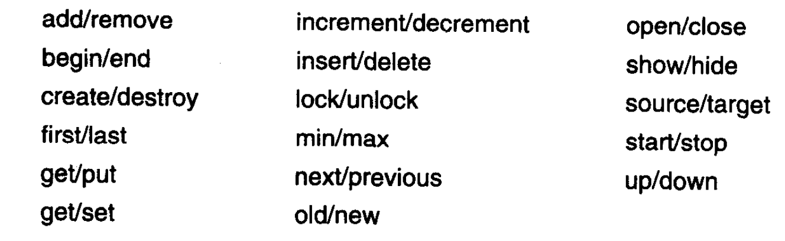

### 软件的构建(一)
软件的构建是软件开发的核心活动主要包括: 设计 编码 调试 集成 开发者测试(单元测试, 集成测试)。这些工作决定了以后维护软件的成本。

### 高质量的子程序(七)
**在编写子程序函数时注意事项**
- 变量名一定要让人明白这个函数大概是做什么的
- 复杂子程序需要说明文档
- 传入的值最好不要被改变
- 设计的子程序目的要单一
- 副作用一定要少,没有最好
- 子程序中的数值最好用常量代替
```js
    // bad
    if (env === 1) {}

    // good
    const local = 1
    if (env === local) {}
```
- 参数不要太多
**在编写子程命名注意事项**
- 使用handle+名字用做于事件函数的名字(React遵循此规则)
- 名字尽量描述出函数做的事情且不要用数字进行区分
- 如果有返回值命名要让阅读者知道返回什么。动词加宾语的命名更强调过程若名词则强调返回值
- 命名反义词


### 防御式编程(八)